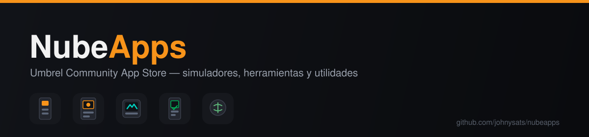
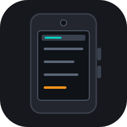
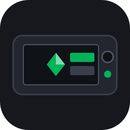
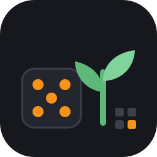

<p align="center">
  
</p>

<p align="center">
<a href="https://github.com/johnysats/nubeapps"></a>
</p>

App store comunitario para [umbrelOS](https://umbrel.com). Cada subcarpeta `nubeapps-*` es una
app instalable desde Umbrel.

> **Nota:** este store no es oficial ni está afiliado a Umbrel. Lo mantengo yo solo,
> independiente del store oficial. Todas las apps son simuladores de hardware firmware/software
> real, pensados para aprender y probar sin tocar fondos ni seeds reales.

## Instalar el store

En umbrelOS: **App Store → Community App Store → Add** y pegar la URL de este repo
(`https://github.com/johnysats/nubeapps`).

## Apps

| Logo | App | Descripción | Puerto |
|:---:|---|---|:---:|
|  | [Coldcard Q1 Simulator](nubeapps-ccq1/) | Simulador Coldcard Q1 en el navegador + explorador de la MicroSD para subir/bajar PSBTs | 8611 |
|  | [SeedSigner Simulator](nubeapps-seedsigner/) | Simulador SeedSigner en el navegador; la cámara virtual lee los QR de los archivos que subís a `/files` | 8612 |
|  | [Krux Simulator](nubeapps-krux/) | Simulador Krux (Maix Amigo) en el navegador: pantalla táctil, MicroSD en `/files` y cámara virtual | 8613 |
|  | [Jade Plus Simulator](nubeapps-jadeplus/) | Simulador Blockstream Jade Plus: el firmware real de ESP32 en el emulador QEMU de upstream, con cámara virtual desde `/files` | 8614 |
|  | [Bitcoin Seed Tool en Español](nubeapps-seedtool/) | Bitcoin Seed Tool (BitcoinQnA): entropía, BIP39/85/47/352, PSBT, multifirma. HTML único del release firmado, con capa de traducción al español | 8615 |

## ¿Te sirvió?

Si alguna de estas apps te resultó útil, podés invitarme un café en sats:

[](https://pay.blink.sv/johnysats)

## Estructura

```
umbrel-app-store.yml        id del store (prefijo obligatorio de cada app id)
nubeapps-<app>/
  umbrel-app.yml            manifest que lee umbrelOS
  docker-compose.yml        servicios (app_proxy + los propios)
  data/**/.gitkeep          dirs de bind mount que tienen que existir al primer arranque
images/<imagen>/            fuentes de las imágenes propias (Umbrel no permite `build:`)
.github/workflows/          build multi-arch y push a GHCR
```

## Cómo se construyen las imágenes

Umbrel exige imágenes públicas ya construidas, con `linux/amd64` **y** `linux/arm64`, pinneadas
por digest. El workflow [`images.yml`](.github/workflows/images.yml) publica en GHCR: el
simulador de Coldcard compila firmware, así que va en runners nativos (`ubuntu-24.04` y
`ubuntu-24.04-arm`); el de SeedSigner es Python puro y sale de un buildx multi-arch normal.
El de Jade compila el firmware de ESP32 en un stage fijado a `linux/amd64` (la toolchain de
Blockstream solo existe para esa arquitectura) y el binario que sale de ahí vale para las dos
plataformas, porque lo ejecuta qemu.

Después de cada build hay que actualizar el digest en el `docker-compose.yml` de la app:

```sh
docker buildx imagetools inspect ghcr.io/johnysats/ccq1-simulator:6.6.0QX
```

y copiar el `Digest:` del índice (el de arriba de todo, no el de una arquitectura).

## Desarrollo

Para iterar sin hacer push a cada cambio, sincronizar el paquete directamente contra el store
ya sincronizado en el Umbrel de prueba:

```sh
rsync -av --delete --exclude=.gitkeep nubeapps-ccq1/ umbrel@<host>:~/umbrel/app-stores/<slug>/nubeapps-ccq1/
ssh umbrel@<host> umbreld client apps.install.mutate --appId nubeapps-ccq1
ssh umbrel@<host> umbreld client apps.logs.query --appId nubeapps-ccq1
```
